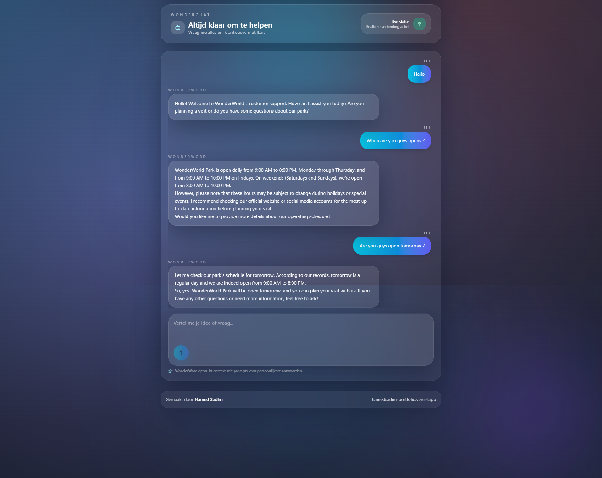

# WonderChat (Full Stack)



AI-powered WonderWorld assistant built with a Vite + React client and an Express + Bun server that talks to a local [Ollama](https://ollama.com) model. The UI embraces glassmorphism, typing audio, markdown messages, a navbar, and footer crediting **Hamed Sadim**.

## Table of contents

1. [Project overview](#project-overview)
2. [Repository layout](#repository-layout)
3. [Root workspace](#root-workspace)
4. [Client app (`packages/client`)](#client-app-packagesclient)
5. [Server app (`packages/server`)](#server-app-packagesserver)
6. [Environment variables](#environment-variables)
7. [Development workflow](#development-workflow)
8. [Production notes](#production-notes)
9. [Troubleshooting](#troubleshooting)

## Project overview

- **Goal**: Provide a chat experience for WonderWorld visitors, backed by curated prompts (`packages/server/prompts`) and a local LLM via Ollama.
- **Stack**: Bun runtime, Express, Vite, React, TypeScript, Tailwind utilities, `react-hook-form`, `react-markdown`, and Lucide icons.
- **Highlights**: Neon gradients, glass panels, navbar/footer, markdown answers, audio feedback, and conversation memory by `conversationId`.

## Repository layout

```text
├── index.ts               # Concurrently launches client + server in dev
├── package.json           # Workspace root scripts + dev tooling
├── tsconfig.json          # Root TS config (extends to packages)
├── packages/
│   ├── client/            # Vite React front-end (UI, assets, styling)
│   └── server/            # Bun Express backend + Ollama integration
├── .husky/                # Git hooks (prepare via `bun prepare`)
├── .lintstagedrc          # Lint-staged config
└── README.md              # This document
```

## Root workspace

- **Scripts** (`package.json`)
  - `bun run dev`: runs `index.ts`, which uses `concurrently` to start client + server dev servers.
  - `bun run format`: formats the repo with Prettier.
  - `bun run prepare`: installs Husky hooks.
- **Shared config**: `.prettierrc`, `.lintstagedrc`, TypeScript config, and Bun lockfile.

## Client app (`packages/client`)

- **Framework**: React + Vite + TypeScript with Tailwind via `@tailwindcss/vite`.
- **Entry points**:
  - `src/main.tsx`: mounts `<App />` with the theme styles.
  - `src/App.tsx`: wraps the entire experience (glow background, navbar, ChatBot, footer).
- **Key UI components** (`src/components/Chat`):
  - `ChatBot.tsx`: handles state, audio cues, API calls, and layout.
  - `ChatMessages.tsx`: renders markdown responses and user/assistant bubbles.
  - `ChatInput.tsx`: glass textarea with enter-submit and gradient send button.
  - `TypingIndicator.tsx`: animated dots in a glass badge.
- **Styling**: `src/index.css` defines theme tokens, gradients, `.glass-panel`, custom scrollbar, etc.
- **Config**:
  - `vite.config.ts`: sets alias `@ → src`, adds Tailwind plugin, and proxies `/api` → `http://localhost:3000` for dev.
  - `.env.example`: exposes `VITE_API_BASE_URL` for builds that need an absolute API URL.
- **Scripts** (`package.json`)
  - `bun run dev`: Vite dev server (default port 5173).
  - `bun run build`: production build (outputs to `dist/`).
  - `bun run preview`: preview the built app.

## Server app (`packages/server`)

- **Runtime**: Bun with Express 5, Zod validation, and native `fetch` (Bun).
- **Flow**:
  1. `index.ts` loads env vars, boots Express, and mounts `routes.ts`.
  2. `routes.ts` exposes `/api/chat` which delegates to `chatController`.
  3. `chat.controller.ts` validates input (prompt + UUID conversationId) using Zod, then calls `chatService`.
  4. `chat.service.ts` loads WonderWorld prompt templates, tracks conversation history via `conversationRepository`, and calls Ollama (`/api/chat`).
  5. Responses are stored back into the repository so future turns share context.
- **Prompts** (`prompts/`):
  - `chatbox.txt`: main system instructions with `{{parkInfo}}` placeholder.
  - `WonderWord.md`: data inserted into the prompt (park info, attractions, etc.).
- **State store** (`repositories/conversation.repository.ts`): in-memory map of conversation history. Swap for Redis/Postgres in production.
- **Scripts** (`package.json`)
  - `bun run dev`: watch mode (`bun --watch run index.ts`).
  - `bun run start`: runs the server once (`bun run index.ts`).
- **Dependencies**: Express, Zod, dotenv. OpenAI SDK removed; Ollama used directly.

## Environment variables

### Server (`packages/server/.env`)

```dotenv
PORT="3000"
OLLAMA_BASE_URL="http://127.0.0.1:11434"
OLLAMA_MODEL="llama3.1"
OLLAMA_TEMPERATURE="0.2"
OLLAMA_MAX_TOKENS="256"
```

These control the Bun server port and Ollama connection. Adjust for your deployed environment.

### Client (`packages/client/.env`)

```dotenv
VITE_API_BASE_URL="http://localhost:3000/api"
```

Optional—defaults to `/api` so the Vite proxy handles dev requests. Set an absolute URL when deploying the client separately from the API.

## Development workflow

1. Install deps: `bun install` (root).
2. Ensure Ollama daemon is running: `ollama serve` and `ollama pull llama3.1` (or another model you reference in `.env`).
3. Start both apps: `bun run dev` (runs `index.ts` → `concurrently`).
   - Server listens on `http://localhost:3000` and exposes `/api/chat`.
   - Client runs on `http://localhost:5173` and proxies `/api` calls to the server.
4. Open `http://localhost:5173`, type a prompt, and watch the conversation update with glass effects + audio cues.

Run apps separately if needed:

```bash
cd packages/server && bun run dev
cd packages/client && bun run dev
```

## Production notes

1. Build client assets: `cd packages/client && bun run build` → `dist/`.
2. Serve the static files (via CDN, reverse proxy, or from the server).
3. Deploy the Bun server (or transpile to Node) with `.env` pointing to a reachable Ollama endpoint.
4. Consider persisting conversations in a real datastore (Redis/Postgres) instead of in-memory maps for multi-instance deployments.

## Troubleshooting

- **React Markdown error**: Versions ≥9 disallow `className` on `<ReactMarkdown>`. Wrap it in a styled container instead (already in code).
- **No response from chat**: Check server logs and ensure Ollama is reachable. Use `curl` to POST to `/api/chat` with prompt + UUID.
- **Ollama failures**: Confirm the model exists (`ollama list`) and matches `OLLAMA_MODEL`.
- **Proxy issues**: If deploying client separately, set `VITE_API_BASE_URL` to the full server URL or configure your proxy accordingly.

---

Created by **Hamed Sadim** — [Portfolio](https://hamedsadim-portfolio.vercel.app)
